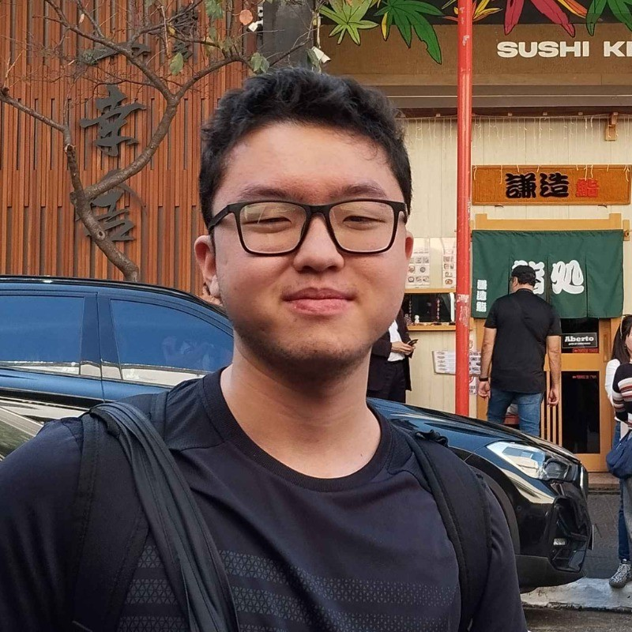

<head>

# Computer Science Student | Interested in AI, ML and Cybersecurity

***About me***

I'm studying Computer Science at the UnDF, I want work/study out the Brazil because I want to more visibility to my work and since school I have contact with programming through olympiads and courses that were offered as OBR and OBI, with this I started to like the area and continue studying.

Sou estudante da UnDF do curso de Ciência da Computação, quero trabalhar/estudar fora de Brasília-DF afim de ter maior visibilidade no mercado e desde a escola tenho contato com programação por meio de olimpíadas e de cursos que eram ofertados como a OBR e a OBI, com isso comecei a gostar pela área e continuo estudando.

</head>

***Interests***

- 🤖 Artificial Intelligence;
- 📝 Machine Learning;
- 🛡️​ CyberSegurança;
- 📊 Data Science.

***Acquirements***
  
- English Basic;
- Python (APIs, Plotly, Pandas);
- Methodologies Ágile (SCRUM);
- Database Modeling;
- MySQL;
- Docker;
- Linux;
- JavaScript;
- Excel;
- Git.

***Tecnologies and Languages***

## <a href=https://github.com/K3nz002/Projetos-Pessoais><text decoration="none">Personal Projects</text></a>

## Statistics of GitHub

## Contact

